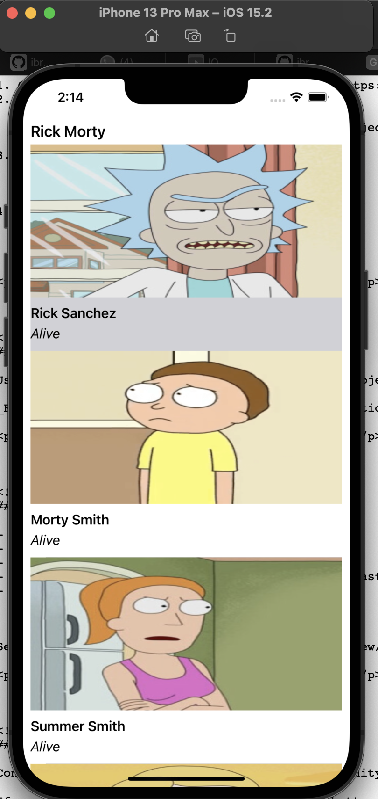

## About Project 

This app showing Rick and Morty characters in a tableView. Fetching datas from API and show character names and photos. 


## Screenshots




## Usage 

1. Clone the repository and open RickMortyAppUsingSnapkit folder.
   ```
      git clone https://github.com/ibrahim-demirci/SwiftProjects.git
   ```
2. Double click to RickMortyAppUsingSnapkit.xcodeproj
3. Then Xcode will get packages automatically. 
4. Build and run.


## Built With

MVVM Architecture
Snapkit 
Alamofire
AlamofireImage


## 	Licence 

Distributed under the MIT Licence.

