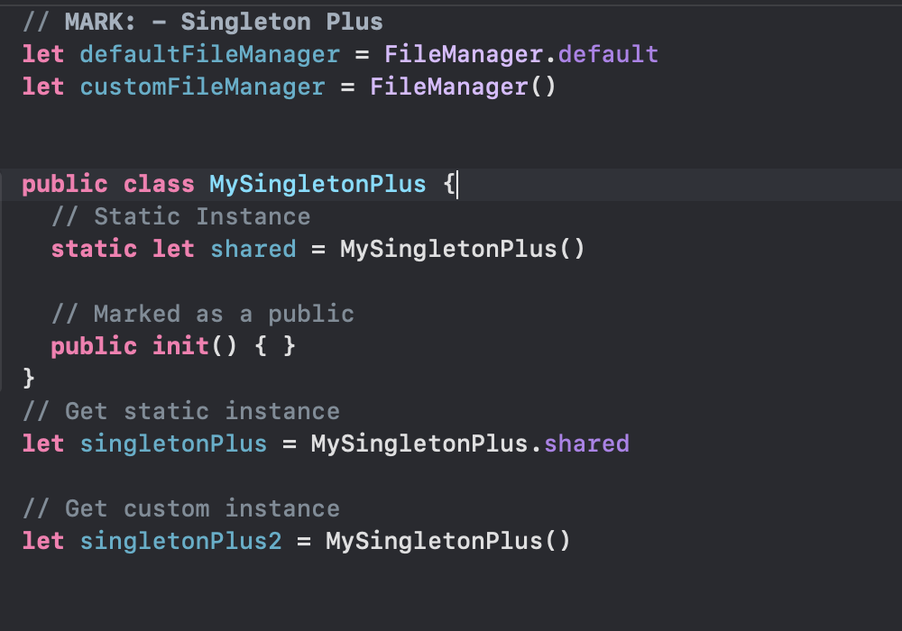

# Singleton Pattern

## Code Structure

## 

#### Singleton

#### SingletonPlus

## Be Careful 

- Very easy to overuse.

- Not appropriate if you are simply trying to pass information from one vc to another.

- Consider whether a singleton plus makes more sense.

- Tests can be problematic. Order of tests can matter. 

  